<!--
  README last updated for Mukeshkumar Prajapati's GitHub profile.
  Replace every occurrence of MrMike24 below with your actual GitHub handle
  so the stats/trophy/snake widgets and links point to your account.
-->

<div align="center">



<br/>

<a href="https://github.com/MrMike24">
  
</a>

<br/>


</div>

<br/>

<!-- ============================================================ -->
<!-- ABOUT ME -->
<!-- ============================================================ -->

## 🧠 About Me

<table>
<tr>
<td width="60%" valign="top">

Software Engineer specializing in **Artificial Intelligence**, **Machine Learning**, and **Natural Language Processing** for data-intensive applications. I design end-to-end AI systems, predictive analytics pipelines, and Generative AI solutions using Python, PyTorch, scikit-learn, FastAPI, and LLM APIs.

I built and **co-authored an IEEE-published, IEEE Xplore–indexed** AI-powered financial analysis platform integrating machine learning, NLP, sentiment analysis, and real-time data processing, and completed Data Science and Data Analytics internships delivering predictive models and business intelligence solutions.

Currently pursuing an **M.Sc. in Computational Linguistics (AI & NLP)** at Heidelberg University, with a strong focus on scalable AI systems, intelligent software engineering, and applied machine learning.

</td>
<td width="40%" valign="top">

| | |
|---|---|
| 🎓 **Current Study** | M.Sc. Computational Linguistics (AI & NLP), Heidelberg University |
| 📍 **Location** | Heidelberg, Germany |
| 🔬 **Research Focus** | AI · ML · NLP · Generative AI |
| 📰 **Publication** | IEEE ICETEG 2025 · IEEE Xplore |
| 🗣️ **Languages** | English (C1) · German (A2, learning) |
| ✉️ **Email** | pramukesh872@gmail.com |

</td>
</tr>
</table>

<br/>

<!-- ============================================================ -->
<!-- CURRENT MISSION -->
<!-- ============================================================ -->

## 🎯 Current Mission

```
┌─ 2025 ───────────────────────────────────────────────────────────┐
│  ✔  Published "WealthWise" at IEEE ICETEG 2025 (IEEE Xplore)      │
│  ✔  Data Analytics Internship — Quantium                          │
│  ✔  Data Science Internship — British Airways                     │
├─ 2026 ───────────────────────────────────────────────────────────┤
│  ▶  M.Sc. Computational Linguistics (AI & NLP) — Heidelberg Uni    │
│  ▶  Contributing to QuantLib (C++ quantitative finance library)   │
│  ▶  Learning German → targeting B1 fluency                        │
│  ▶  Deepening focus on scalable, systems-level AI engineering     │
└─────────────────────────────────────────────────────────────────┘
```

<br/>

<!-- ============================================================ -->
<!-- EXPERIENCE -->
<!-- ============================================================ -->

## 💼 Experience

<table>
<tr>
<td width="50%" valign="top">

### 🩶 Data Science Intern
**British Airways** · Sept 2025 – Oct 2025

- Built predictive models via data preprocessing, feature engineering, and ML to analyze lounge eligibility for passengers at Heathrow Terminal 3
- Ran EDA and feature selection to identify key drivers of customer eligibility
- Applied data visualization and statistical analysis for targeted marketing and customer segmentation
- Partnered with cross-functional stakeholders to translate analytical results into business decisions

</td>
<td width="50%" valign="top">

### 📊 Data Analytics Intern
**Quantium** · Jul 2025 – Sept 2025

- Analyzed large-scale retail transaction data in Python to surface purchasing behavior, financial patterns, and revenue trends
- Performed customer segmentation and A/B testing to evaluate strategies and optimize ROI
- Cleaned, transformed, and validated datasets for high-quality analysis and reporting
- Built dashboards and visual reports to support strategic decision-making

</td>
</tr>
</table>

<br/>

<!-- ============================================================ -->
<!-- EDUCATION -->
<!-- ============================================================ -->

## 🎓 Education

| Period | Institution | Program | Result |
|---|---|---|---|
| 2026 – Present | **Heidelberg University**, Germany | M.Sc. Computational Linguistics (AI & NLP) | In progress |
| 2021 – 2025 | **SIES Graduate School of Technology** (Autonomous), Mumbai University, India | B.E. Electronics & Computer Science Engineering — Honors in Cybersecurity | CGPA 8.07 / 10 |
| 2019 – 2021 | SS High School and Jr. College, Mumbai University, India | Higher Secondary Certificate | 80.17 / 100 |

<br/>

<!-- ============================================================ -->
<!-- OPEN SOURCE -->
<!-- ============================================================ -->

## 🌱 Open Source Contributions

<table>
<tr>
<td>

**QuantLib** (C++) — *May 2026*
> Diagnosed a cross-platform build failure in `blackvolatilitysurface` code where `std::vector` was used without a proper include, relying on an implicit forward declaration that failed on stricter toolchains. Fix was **merged into mainline by the library author** — demonstrating the ability to navigate a large, production-grade C++ financial library and resolve non-obvious portability issues.

 

</td>
</tr>
</table>

<br/>

<!-- ============================================================ -->
<!-- FEATURED PROJECTS -->
<!-- ============================================================ -->

## 🚀 Featured Projects

<table>
<tr>
<td width="100%">

### 💹 WealthWise — AI-Based Stock Analysis Chatbot
<sub>IEEE ICETEG 2025 · IEEE Xplore Indexed</sub>

An AI-powered stock analysis platform integrating Machine Learning, NLP, technical indicators, and Generative AI to support intelligent investment decisions.

**Architecture**
- End-to-end pipeline for real-time financial data acquisition, preprocessing, feature engineering, and predictive analytics via Yahoo Finance APIs
- Technical indicator engine: RSI, MACD, EMA, ADX, ATR, Bollinger Bands, OBV
- Google Gemini AI integrated with financial news sentiment analysis (VADER + TextBlob) for context-aware Buy / Sell / Hold recommendations
- Interactive Streamlit + Plotly web app for real-time visualization of trends, indicators, and AI insights

**Results:** 90.22% accuracy · 91.23% precision · 92.86% recall · 92.04% F1-score


<a href="https://github.com/MrMike24"></a>


</td>
</tr>
</table>

<br/>

<!-- ============================================================ -->
<!-- IEEE PUBLICATION -->
<!-- ============================================================ -->

## 📄 IEEE Publication

<table>
<tr>
<td>

### WealthWise: An AI-Based Stock Analysis Tool
<sub>📚 IEEE International Conference on Emerging Technologies in Electronics and Green Energy (ICETEG 2025) · Indexed in IEEE Xplore</sub>

Co-authored research on an AI-powered financial analysis platform combining Machine Learning, NLP, Generative AI, sentiment analysis, and technical indicators for stock market prediction. Proposed a hybrid framework integrating real-time financial data, technical analysis, Google Gemini AI, and market sentiment to generate intelligent investment recommendations — evaluated using industry-standard metrics (90.22% accuracy, 91.23% precision, 92.86% recall, 92.04% F1-score).


</td>
</tr>
</table>

<br/>

<!-- ============================================================ -->
<!-- AI ARSENAL -->
<!-- ============================================================ -->

## ⚡ AI Arsenal

| Domain | Proficiency |
|---|---|
| Machine Learning (PyTorch, Scikit-learn) | `█████████░` 90% |
| Natural Language Processing (spaCy, NLTK, Transformers, Stanza) | `████████░░` 85% |
| Generative AI & LLM APIs | `████████░░` 80% |
| Systems / Low-Level C++ (SIMD, lock-free structures) | `█████████░` 90% |
| Python (Data & ML systems) | `█████████░` 95% |
| Distributed Infra (Kafka, Redis, AWS, Docker) | `███████░░░` 75% |
| Quantitative Research & Time-Series | `███████░░░` 75% |

<br/>

<!-- ============================================================ -->
<!-- TECH STACK -->
<!-- ============================================================ -->

## 🧰 Tech Stack

**Languages**
<br/>


**AI / ML / NLP**
<br/>


**Frameworks & Web**
<br/>


**Cloud / Data / DevOps**
<br/>


<br/>

<!-- ============================================================ -->
<!-- GITHUB DASHBOARD -->
<!-- ============================================================ -->

## 📊 GitHub Dashboard

<div align="center">


<br/>


<br/>


<br/><br/>


<br/><br/>


<br/><br/>


</div>

<br/>

<!-- ============================================================ -->
<!-- ACHIEVEMENTS -->
<!-- ============================================================ -->

## 🏆 Achievements

```
◆ Technical Coordinator — IEEE Student Branch
   Organized AI, cybersecurity, and software engineering seminars; coordinated
   hackathons, technical competitions, student volunteers, and event logistics.

◆ Workshop Organizer — AI & NLP Community
   Conducted technical workshops on Machine Learning, LLMs, Generative AI,
   and Python for students and developers.

◆ Student Ambassador — Mumbai University
   Represented the university at academic events, mentored prospective
   students, and promoted research, innovation, and student engagement.

◆ BCG X — Generative AI Virtual Experience Program
   Developed AI-powered business solutions using Prompt Engineering, LLMs,
   Generative AI, and AI workflow design.

◆ J.P. Morgan — Software Engineering Virtual Experience Program
   Applied software development, system design, debugging, version control,
   backend development, and problem-solving principles.
```

<br/>

<!-- ============================================================ -->
<!-- RESEARCH INTERESTS -->
<!-- ============================================================ -->

## 🔬 Research Interests

<table>
<tr>
<td width="20%" align="center">

**🤖 Generative AI**
<br/>LLM-driven applications & prompt engineering

</td>
<td width="20%" align="center">

**🗣️ NLP**
<br/>Sentiment analysis, text pipelines, linguistic modeling

</td>
<td width="20%" align="center">

**📈 Quantitative Research**
<br/>Time-series analysis, portfolio optimisation, backtesting

</td>
<td width="20%" align="center">

**🕸️ Graph Neural Networks**
<br/>Structured & relational learning

</td>
<td width="20%" align="center">

**⚙️ Systems for AI**
<br/>SIMD, lock-free structures, scalable ML infra

</td>
</tr>
</table>

<br/>

<!-- ============================================================ -->
<!-- CURRENT LEARNING ROADMAP -->
<!-- ============================================================ -->

## 🗺️ Current Learning Roadmap

- [x] IEEE-published research in AI-driven financial analysis
- [x] Production-grade C++ open-source contribution (QuantLib)
- [ ] M.Sc. coursework in Computational Linguistics (AI & NLP) — *in progress*
- [ ] German language proficiency: A2 → B1
- [ ] Deeper specialization in scalable, systems-level AI engineering

<br/>

<!-- ============================================================ -->
<!-- CAREER GOALS -->
<!-- ============================================================ -->

## 🧭 Career Goals

| Milestone | Focus |
|---|---|
| 🎓 Complete M.Sc. in Computational Linguistics | AI & NLP specialization at Heidelberg University |
| 🧪 Continue applied AI/NLP research | Building on IEEE-published work |
| 🏗️ Grow as a Software Architect | Scalable AI systems & intelligent software engineering |
| 🌍 Reach German B1 fluency | Supporting long-term work in Germany |

<br/>

<!-- ============================================================ -->
<!-- FUN FACTS -->
<!-- ============================================================ -->

## ✨ Fun Facts

<table>
<tr>
<td width="33%" align="center">

🧩 **Bug Hunter**
<br/>Fixed a portability bug in QuantLib, a production-grade C++ financial library — merged by the library author

</td>
<td width="33%" align="center">

🗣️ **Language Learner**
<br/>English (C1) and currently building German (A2 → B1)

</td>
<td width="33%" align="center">

🎤 **Community Builder**
<br/>Organized hackathons & AI/NLP workshops as IEEE Technical Coordinator

</td>
</tr>
</table>

<br/>

<!-- ============================================================ -->
<!-- CONNECT -->
<!-- ============================================================ -->

## 📡 Connect With Me

<div align="center">

<a href="mailto:pramukesh872@gmail.com">

</a>
<a href="https://linkedin.com/in/MrMike24">

</a>
<a href="https://github.com/MrMike24">

</a>
<a href="#">

</a>

<br/><br/>

<sub>📍 Heidelberg, Germany</sub>

</div>

<br/>


<div align="center">
<sub>Thanks for stopping by — always happy to talk AI, NLP, and systems engineering. 🚀</sub>
</div>
